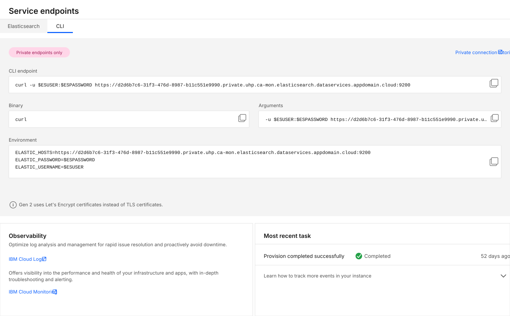

---
copyright:
  years: 2018, 2026
lastupdated: "2026-08-28"

keywords: connecting elasticsearch, databases, curl

subcollection: databases-for-elasticsearch-gen2

---

{{site.data.keyword.attribute-definition-list}}

# Connecting with `cURL`
{: #connecting-curl}

You can access your Elasticsearch database directly from a command-line terminal through cURL. Elasticsearch has a wide variety of REST APIs that allow for [cluster monitoring](https://www.elastic.co/guide/en/elasticsearch/reference/current/cluster.html){: external}, [index management](https://www.elastic.co/guide/en/elasticsearch/reference/current/indices.html){: .external} and [searching](https://www.elastic.co/guide/en/elasticsearch/reference/current/search.html){: .external} within the database.

{{site.data.keyword.databases-for-elasticsearch}} Gen2 requires VPC connectivity. All connection examples assume you have configured Virtual Private Endpoints (VPE) and are connecting from within the VPC environment. Connections from outside the VPC will fail.
{: important}

Connection strings are displayed in the _Endpoints_ panel of your deployment's _Overview_ page, and can also be retrieved from the [cloud databases CLI plug-in](/docs/cloud-databases-gen2?topic=cloud-databases-gen2-cdb-reference), and the [API](https://{DomainName}/apidocs/cloud-databases-api/cloud-databases-api-v5#getconnection).

## Prerequisites for Gen2 connectivity
{: #connecting-curl-prerequisites}

Before connecting with cURL:

1. **Configure VPC access**. Ensure your Virtual Private Endpoint (VPE) is set up and configured..
2. **Connect from within VPC**. Your cURL commands must be run from a system that has VPC access (for, example, a virtual server instance within the VPC).
3. **Use private endpoints**. All Gen2 endpoints are private and not accessible from the public internet.

If you experience connectivity issues, see [Troubleshooting connections](/docs/databases-for-elasticsearch-gen2?topic=databases-for-elasticsearch-gen2-troubleshoot-connect&interface=ui).
{: note}

{: caption="Endpoints section, CLI tab" caption-side="bottom"}

The information that you need to make a connection with cURL to your deployment is also in the "CLI" section of a credential created on the *Service credentials* page. The table contains a breakdown for reference.

| Field Name | Index | Description |
| ---------- | ----- | ----------- |
| `Bin` | | The recommended binary to create a connection; in this case it is `curl`. |
| `Composed` | | A formatted command to establish a connection to your deployment. The command combines the `Bin` executable, `Environment` variable settings, and uses `Arguments` as command-line parameters.
| `Environment` | | A list of key/values you set as environment variables. |
| `Arguments` | 0... | The information that is passed as arguments to the command shown in the Bin field. |
| `Type` | | The type of package that uses this connection information; in this case `cli`.  |
{: caption="curl connection information" caption-side="top"}

* `0...` indicates that there might be one or more of these entries in an array.

## Elasticsearch API `cURL` example
{: #elasticsearch-api-curl-example}

```sh
curl -u admin:<password> 'https://{elasticsearch_cluster_private_endpoint}/_cluster/health?pretty'
```

* `curl` - The command itself.
* `-u` - The parameter for the username and password, separated by a colon, to be used as credentials to log in to the Elasticsearch deployment.
* `https://...` - The parameter that specifies the endpoints where the `curl` command connects. It's composed of HTTPS protocol URLs and includes a port number.
* `/_cluster/health?pretty` - An Elasticsearch Cluster API endpoint that returns the status of your cluster.
